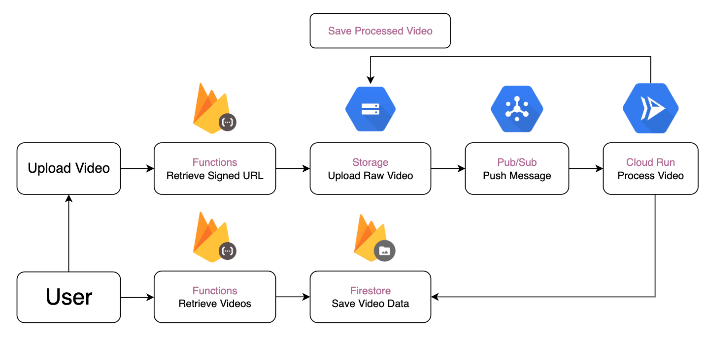

## Description

This project aims to build a YouTube clone application using full-stack technologies. 
It features a web client built with Next.js and Node.js with Express for handling backend video processing, and utilizes Google Cloud to handle user data, and store videos. 
The application will allow users to upload, view, and interact with videos, replicating core YouTube functionalities.

## Directory
yt-web-client - Frontend Nextjs  
yt-api-service - Defines Google Cloud Functions  
video-processing-service - Handles video processing with FFmpeg

## Video Flow Chart

## Tech Stack
- **TypeScript**
- **Next.js**
- **Express.js**
- **Docker**
- **FFmpeg**
- **Firebase Auth**
- **Firebase Functions**
- **Firebase Firestore**
- **Google Cloud Storage**
- **Google Cloud Pub/Sub**
- **Google Cloud Run**

- ## Features

- **User authentication (sign in/out):** Secure user authentication with Firebase Auth.
- **Video upload and processing:** Users can upload and share videos. Uploaded video are processed using FFmpeg.

