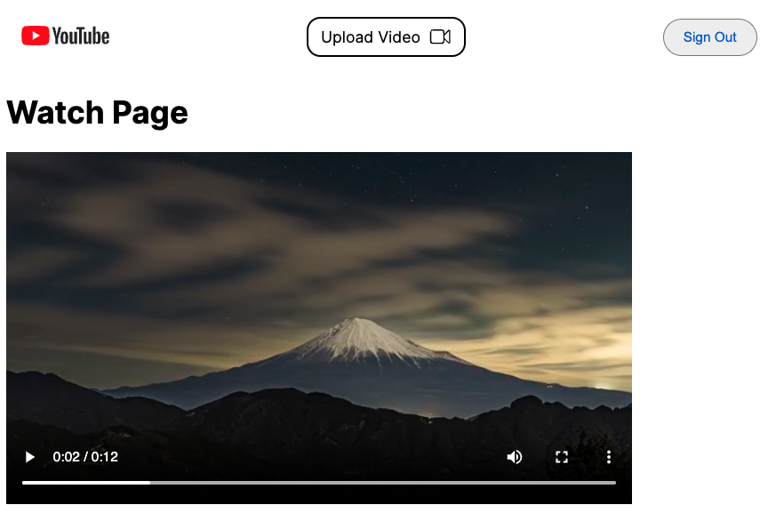

# YouTube Clone

## Screenshots

## Description

This project aims to build a full-stack YouTube clone application using full-stack technologies. 
It will feature a web client built with Next.js and Node.js with Express for handling backend service. 
The application will allow users to upload, view, and interact with videos, replicating core YouTube functionalities.

## Intended Tech Stack
- **TypeScript**
- **Next.js**
- **Express.js**
- **Docker**
- **FFmpeg**
- **Firebase Auth**
- **Firebase Functions**
- **Firebase Firestore**
- **Google Cloud Storage**
- **Google Cloud Pub/Sub**
- **Google Cloud Run**

- ## Features

- **Host videos:** Users can upload and share videos.
- **User authentication (sign in/out):** Secure user authentication with Firebase Auth.
- **Video upload and processing:** Upload videos, which will be processed using FFmpeg.
- **Watch videos:** Users can watch videos, including transcoded versions for different resolutions.
- **Manage video metadata:** Edit and manage video titles, descriptions, and other metadata.
